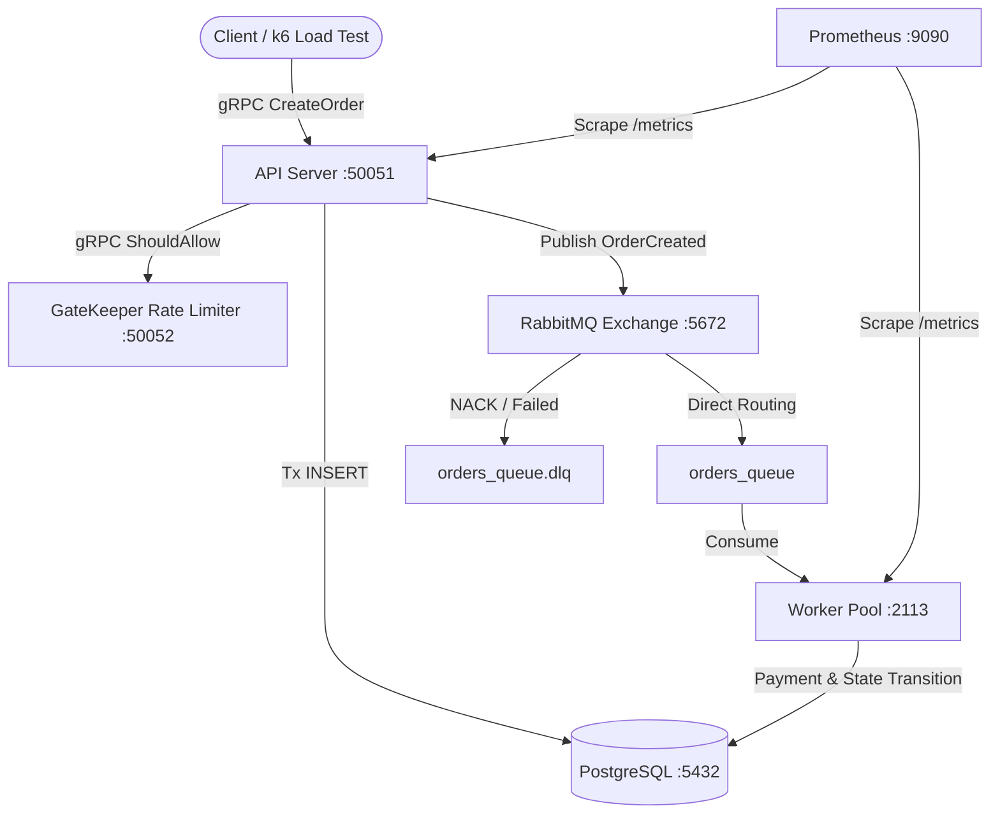

# Order Flow Engine — Distributed Order Processing Pipeline

A high-throughput, fault-tolerant distributed order processing pipeline written in Go. Accepts client orders over gRPC, performs rate-limiting checks via [GateKeeper](https://github.com/arthkinq/gatekeeper), publishes tasks to RabbitMQ, and processes orders concurrently using a Worker Pool backed by PostgreSQL transactions.

---

## Architecture Diagram



---

## Tech Stack

| Technology | Purpose |
|---|---|
| Go 1.22+ | Core programming language |
| gRPC & Protobuf | Client API contract (`CreateOrder`, `GetOrder`) |
| RabbitMQ | Message broker with Direct Exchange, Manual ACKs, and DLQ |
| PostgreSQL 16 | Relational storage for orders and line items with ACID transactions |
| [GateKeeper](https://github.com/arthkinq/gatekeeper) | Distributed rate limiter integration (Fail-Open policy) |
| Prometheus | Metrics collection (`orders_created_total`, `orders_processed_total`, latency) |
| Docker Compose | Infrastructure stack management |
| k6 | Automated gRPC load testing |

---

## Key Design Decisions

1. **Fail-Open Policy on Rate Limiter**: If [GateKeeper](https://github.com/arthkinq/gatekeeper) is unavailable or times out (>200ms), the API fails open to maintain business availability over rate-limit strictness.
2. **Manual ACKs & Dead Letter Queue (DLQ)**: Workers use manual acknowledgments (`autoAck = false`). Unprocessable or failed messages are automatically routed to `orders_queue.dlq` for post-mortem analysis without blocking the pipeline.
3. **State Machine & Data Integrity**: Order state transitions (`PENDING -> PROCESSING -> COMPLETED / FAILED`) are strictly enforced via a domain map. Prices are stored in integer cents (`int64 price_cents`) to avoid floating-point rounding errors.
4. **Graceful Shutdown**: All services handle `SIGINT` / `syscall.SIGTERM`. Workers finish in-flight order payments (`sync.WaitGroup`) before terminating cleanly.

---

## Directory Structure

```
order-flow-engine/
├── cmd/
│   ├── api/               # gRPC API Server
│   └── worker/            # Background Worker Pool
├── internal/              # Internal packages (domain, repository, queue, server, worker, ratelimit, metrics)
├── proto/order/v1/        # Protobuf definition and Go stubs
├── migrations/            # SQL migration files
├── deployments/           # Docker Compose & Prometheus config
├── tests/load/            # k6 load testing script
├── Dockerfile             # Multi-stage build specification
└── Makefile
```

---

## Quick Start

### Prerequisites
- Go 1.22+
- Docker Desktop

### 1. Launch Infrastructure & Applications
Start PostgreSQL, RabbitMQ, API Server, Worker Pool, and Prometheus:

```bash
make docker-up
```

### 2. Check Service Endpoints
- **gRPC API**: `localhost:50051`
- **RabbitMQ Management Dashboard**: http://localhost:15672 (User: `guest`, Pass: `guest`)
- **Prometheus UI**: http://localhost:9090
- **API Metrics**: http://localhost:2112/metrics
- **Worker Metrics**: http://localhost:2113/metrics

---

## Testing

### Run All Unit & Integration Tests
```bash
make test
```

### Run gRPC Load Test with k6
```bash
k6 run tests/load/k6_test.js
```
